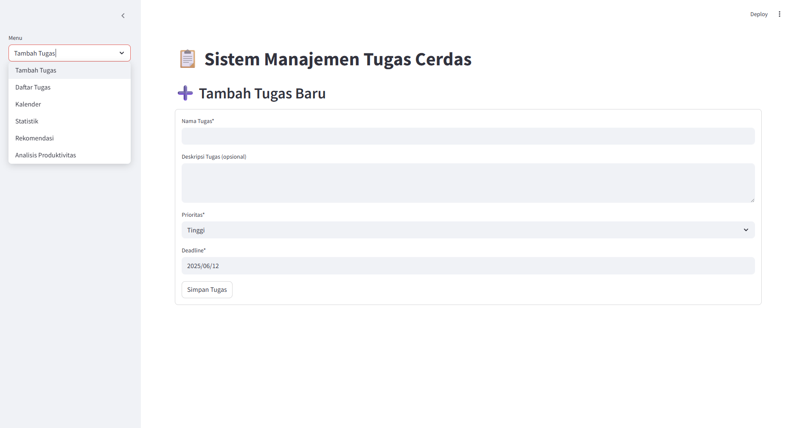

# 📋 Sistem Manajemen Tugas Cerdas

Aplikasi manajemen tugas berbasis web yang membantu mengorganisir, menganalisis, dan mengoptimalkan produktivitas pengguna dengan fitur-fitur cerdas.



## ✨ Fitur Utama

- **Manajemen Tugas Lengkap**
  - Tambah, edit, hapus, dan tandai tugas sebagai selesai
  - Klasifikasi prioritas (Tinggi, Sedang, Rendah)
  - Deadline dan reminder otomatis

- **Analisis Produktivitas**
  - Statistik penyelesaian tugas
  - Pola produktivitas harian/mingguan
  - Prediksi keterlambatan tugas

- **Rekomendasi Cerdas**
  - Waktu optimal untuk mengerjakan tugas
  - Alokasi waktu berdasarkan prioritas
  - Deteksi potensi keterlambatan

- **Visualisasi Data**
  - Grafik distribusi prioritas
  - Analisis waktu penyelesaian
  - Kalender tugas interaktif

## 🛠 Teknologi

- **Frontend**: Streamlit (Python)
- **Backend**: Python 3.8+
- **Machine Learning**: Scikit-learn
- **Data Visualization**: Plotly Express
- **Penyimpanan Data**: CSV

## 🚀 Panduan Instalasi

1. **Clone repository**
   ```bash
   git clone https://github.com/istgrudd/todolist-task-manager.git
   cd todolist-task-manager